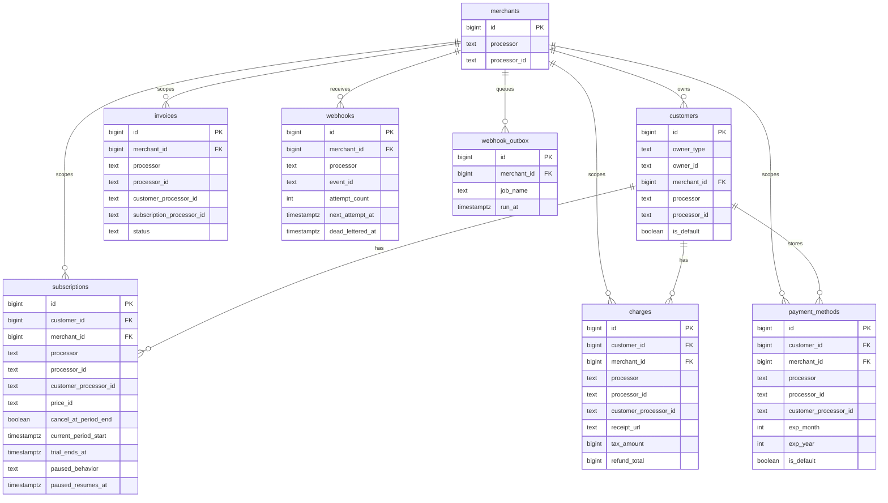

# Sequelize schema (M1 foundation)

This package provides SQL-first schema artifacts for durable billing projections.

## Entity relationship diagram

## Required constraints

- Unique processor resource identity:
  - `merchants(processor, processor_id)`
  - `customers(processor, processor_id)`
  - `subscriptions(processor, processor_id)`
  - `charges(processor, processor_id)`
  - `payment_methods(processor, processor_id)`
- One default customer per owner: `customers(owner_type, owner_id) WHERE is_default`
- One default payment method per customer: `payment_methods(customer_id) WHERE is_default`
- Webhook idempotency: `webhooks(processor, event_id)`
- Webhook outbox idempotency (optional): `webhook_outbox(job_idempotency_key) WHERE job_idempotency_key IS NOT NULL`

## Contract-aligned projection fields

- `customers.metadata` preserves `CustomerRecord.metadata` as JSONB.
- `payment_methods.customer_processor_id`, `payment_methods.exp_month`, `payment_methods.exp_year`, and `payment_methods.raw_payload` map to `PaymentMethodRecord`.
- `charges.customer_processor_id`, `charges.receipt_url`, `charges.tax_amount`, `charges.total_tax_amounts`, `charges.refund_total`, `charges.payment_method_snapshot`, and `charges.raw_payload` map to `ChargeRecord` (`tax_amount` <- `payment_intent.amount_details.tax.total_tax_amount`, `total_tax_amounts` <- `payment_intent.amount_details.line_items[].tax.total_tax_amount`).
- `subscriptions.customer_processor_id`, `subscriptions.price_id`, `subscriptions.cancel_at_period_end`, `subscriptions.current_period_start`, `subscriptions.trial_ends_at`, `subscriptions.paused_behavior`, `subscriptions.paused_resumes_at`, and `subscriptions.raw_payload` map to `SubscriptionRecord`.
- `invoices` stores invoice projections with unique `(processor, processor_id)` plus customer/subscription lookup indexes for predictable reads.
- `webhooks.attempt_count`, `webhooks.next_attempt_at`, `webhooks.last_error`, and `webhooks.dead_lettered_at` support webhook lifecycle transitions.
- `webhook_outbox` provides durable queue storage for `DbOutboxRepository` run-at claims.

## Migration artifacts

- Up migration: `packages/sequelize/migrations/templates/202602190001-m1-foundation-data-model.up.sql`
- Down migration: `packages/sequelize/migrations/templates/202602190001-m1-foundation-data-model.down.sql`
