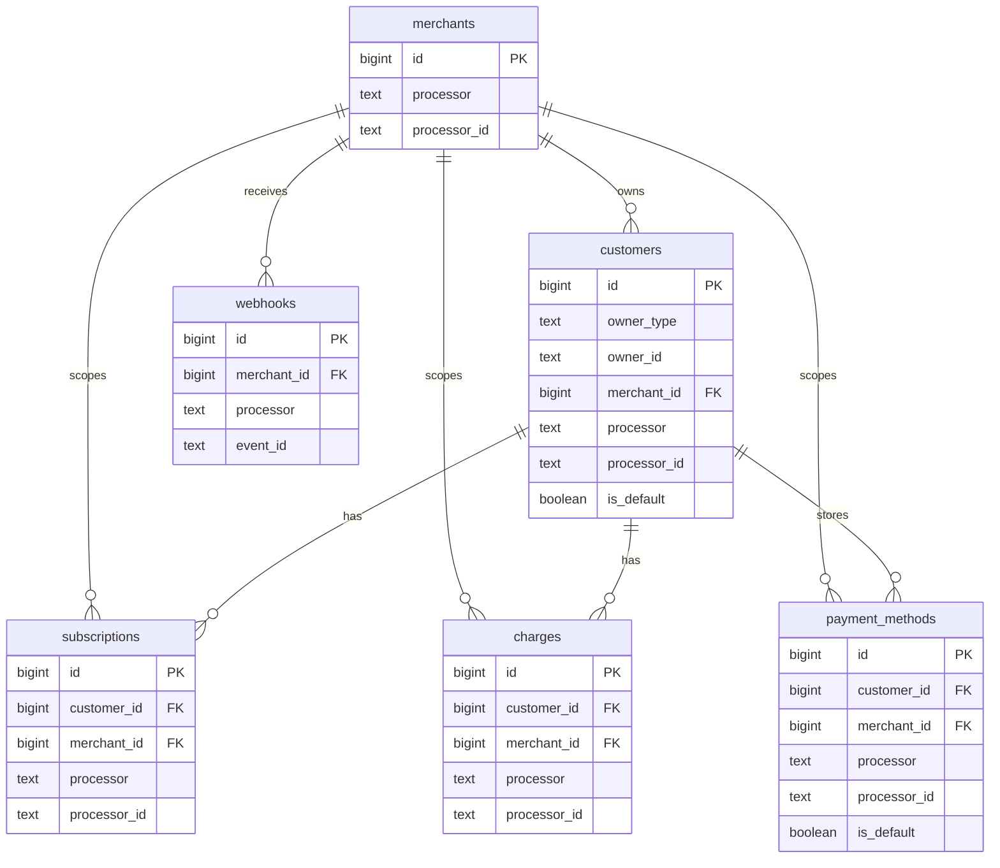

# Sequelize schema (M1 foundation)

This package provides SQL-first schema artifacts for durable billing projections.

## Entity relationship diagram

## Required constraints

- Unique processor resource identity:
  - `merchants(processor, processor_id)`
  - `customers(processor, processor_id)`
  - `subscriptions(processor, processor_id)`
  - `charges(processor, processor_id)`
  - `payment_methods(processor, processor_id)`
- One default customer per owner: `customers(owner_type, owner_id) WHERE is_default`
- One default payment method per customer: `payment_methods(customer_id) WHERE is_default`
- Webhook idempotency: `webhooks(processor, event_id)`

## Migration artifacts

- Up migration: `packages/sequelize/migrations/templates/202602190001-m1-foundation-data-model.up.sql`
- Down migration: `packages/sequelize/migrations/templates/202602190001-m1-foundation-data-model.down.sql`
